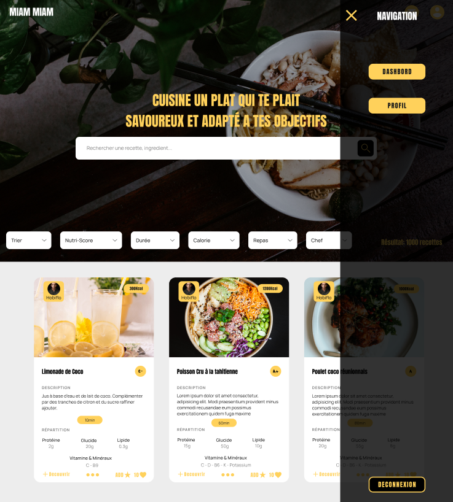

# MiamMiam

Project personnel d'une application web et mobile de recette participatif et reseau social.

# Langage solicité

- SASS
- TypeScript
- REACT
- REDUX
- Node.js
- Express
- MySQL

# Objectif

- Enregistrement & Authentification sécurisé utilisateur
- Modification donnée user
- Ajout de recette / ingredient / ustensil
- Interaction recette (favorie, like, commentaire)
- Interaction user (follow, contact)
- Caclcule et modification objectif dietetique user
- Ajout recette consommé et calcule besoins restant
- Algorithme de trie et recherche des recettes (accueil et user) 

# Maquette

[Canevas](https://www.figma.com/file/eIjCNdPVAgHFVdyXtJ9cI9/Untitled?type=design&node-id=0-1&mode=design&t=yVFQxMlNZAkyPM2h-0)

# Visiter

EN CONSTRUCTION

# Aperçu

